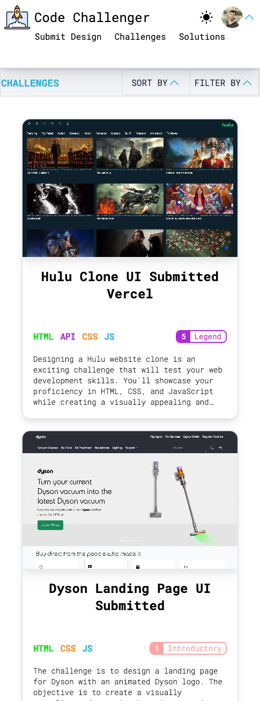

# Code Challenger

Code Challenger is a website that designers can submit their designs and all designs will be available as challenges for front-end developers.
Front-end developers can use these designs as challenges to further improve their talent and practice.

Credit to [FrontEndMentor](https://www.frontendmentor.io/) for being a good example.

## Table of contents

-   [Overview](#overview)
    -   [Functionality](#functionality)
-   [My process](#my-process)
    -   [Built with](#built-with)
    -   [What I learned](#what-i-learned)
-   [Preview](#preview)
    -   [Links](#links)
    -   [Screenshot](#screenshot)
-   [Author](#author)

## Overview

### Functionality

Users should be able to:

-   View the optimal layout for the site depending on their device's screen size
-   Authenticate with Google or Github
-   View Challenges, filter & sort them, download assets
-   Submit their solution & publish it to other users, application will generate a screenshot of the solution as well.
-   Submit Designs for other users to complete as challenges
-   Change theme (dark / light)
-   Review solutions from other users & filter & sort

## My process

### Built with

-   Next.js 13 & React.js
-   [tailwindcss](https://tailwindcss.com/) - CSS Framework
-   Mobile-first workflow
-   Server side rendering
-   Sanity.io
-   Firebase Realtime Database
-   Firebase Authentication
-   Quill
-   puppeteer

### What I learned

-   Sanity.io data fetching & posting
-   Rich text with quill
-   Post processing HTML to sanity block
-   Firebase Realtime Database
-   Firebase Authentication
-   Server-side rendering with additional functionalities (revalidate & static server pages)
-   puppeteer

## Preview

### Links

-   Repo URL: [Solution](https://github.com/enszrlu/code-challenger)
-   Live Site URL: [Live Site](https://code-challenger.vercel.app/)

### Screenshot

## Author

-   Website - [github](https://github.com/enszrlu)
